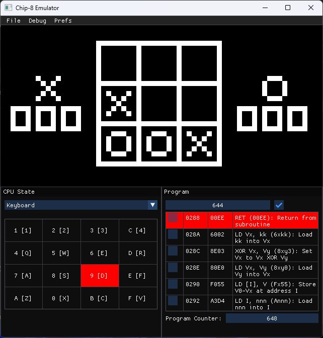

<!-- PROJECT TITLE -->
 

  

  <h1 align="center">Chip8</h1>

  

    A chip-8 emulator and interpreter, built using SFML and Dear ImGui in C++
  

<!-- TABLE OF CONTENTS -->

  
Table of Contents

  <ol>
    <li>
      <a href="#about-the-project">About The Project</a>
      <ul>
        <li><a href="#built-with">Built With</a></li>
      </ul>
    </li>
    <li><a href="#screenshots">Screenshots</a></li>
    <li><a href="#license">License</a></li>
  </ol>

<!-- ABOUT THE PROJECT -->
## About The Project

An emulator slash interpreter built for the [CHIP-8 system](https://en.wikipedia.org/wiki/CHIP-8). Probably works, but maybe not.
If you manage to get it working (it's been too long, I can't figure out how to start it, but it *did* run at some point in the past), there's a bunch of included roms to run.

### Built With

* [SFML](https://www.sfml-dev.org/index.php)
* [Dear ImGui](https://github.com/ocornut/imgui)
* [ImGui-SFML](https://github.com/eliasdaler/imgui-sfml)

<!-- USAGE EXAMPLES -->
## Screenshots

<!-- LICENSE -->
## License

Distributed under the MIT License. See `LICENSE.txt` for more information.

[<a href="#readme-top">Back To Top</a>]

